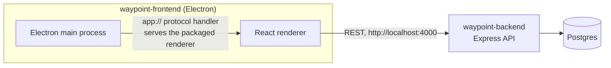

# Waypoint

**The world's first project management tool that actually ships as a native
desktop app.** Not a web page in a browser tab pretending to be an app —
Waypoint is a real Electron application: projects, cycles, modules, work
items, pages, intake, and AI agent assignments, all running natively on your
machine and talking to a real backend, not local-storage.

This repo holds the entire product — frontend and backend — in one place.

| Folder | What it is |
|---|---|
| [`waypoint-frontend`](./waypoint-frontend) | The Electron + React desktop client users actually run |
| [`waypoint-backend`](./waypoint-backend) | The Express + Postgres API that backs it |

## What's in the box

- **Work item tracking** — boards, lists, a calendar view, a Gantt view, and a
  spreadsheet view over the same underlying data, with states, priorities,
  estimates, labels, assignees, sub-items, and full activity history.
- **Cycles & modules** — sprint-style cycles with burndown charts, and modules
  for grouping work items outside the cycle timeline.
- **Pages & saved views** — freeform docs per project, and shareable filtered
  views of your work items.
- **Intake** — a triage queue for incoming requests before they become real
  work items.
- **AI agents** — assign an agent to a work item, hand work back and forth,
  and track agent-driven activity alongside human activity in the same log.
- **Real, address-bar-updating routes** — deep links, hard-refresh, and
  browser back/forward all work correctly, in the dev server, in the packaged
  desktop app, and (by construction) if this ever ships as a plain website too.

## Architecture



The frontend is a normal Electron app: a React renderer talking to a small
Express REST API over HTTP, exactly like it would if this were a website. The
only Electron-specific piece is the main process, which owns the native
window and — in a packaged build — serves the renderer's files through a
custom `app://` protocol with SPA-fallback routing, so real client-side routes
keep working after a hard refresh with no server behind them. In dev, the
renderer is just served by webpack-dev-server, which gets the same behavior
for free.

## Getting started

You need both halves running — the frontend has no offline/mock mode, it
always talks to a real backend.

```bash
# 1. Backend
cd waypoint-backend
cp .env.example .env
docker compose up -d
npm install
npm run db:generate && npm run db:migrate && npm run db:seed
npm run dev              # http://localhost:4000

# 2. Frontend, in a second terminal
cd waypoint-frontend
npm install
npm start                 # opens the Electron app, hot-reloading
```

See each folder's own README for the full script list, project layout, and
how to build a packaged installer.

## Stack

**Frontend:** Electron, React 19, React Router, TypeScript, Tailwind CSS,
webpack (via `electron-react-boilerplate`'s toolchain).

**Backend:** Express, Drizzle ORM, Postgres, Zod, TypeScript.

## License

MIT — see [`LICENSE`](./LICENSE).
