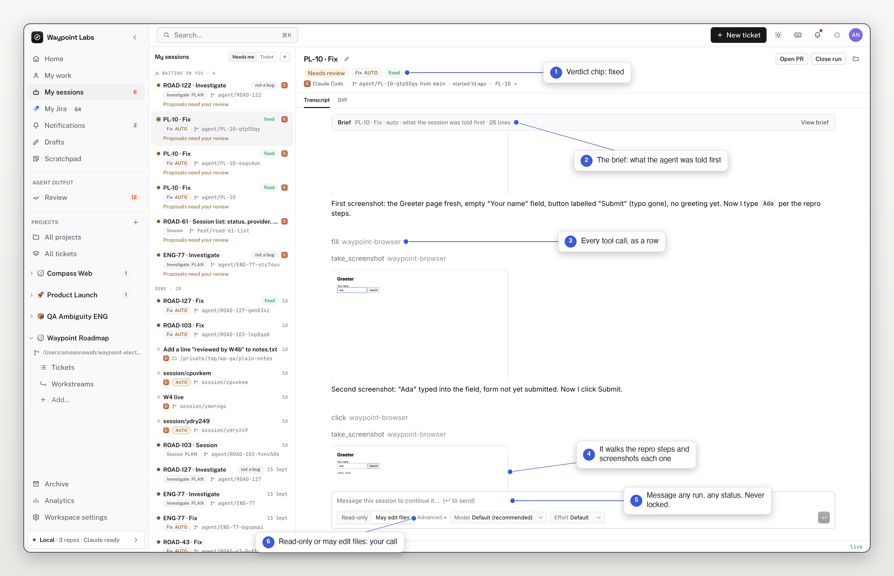
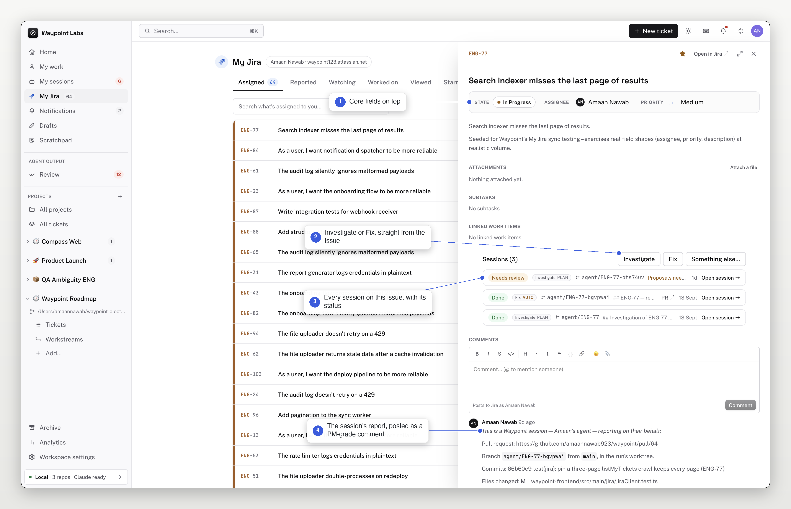
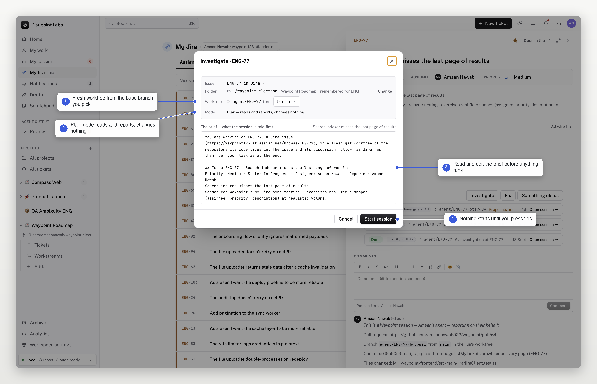
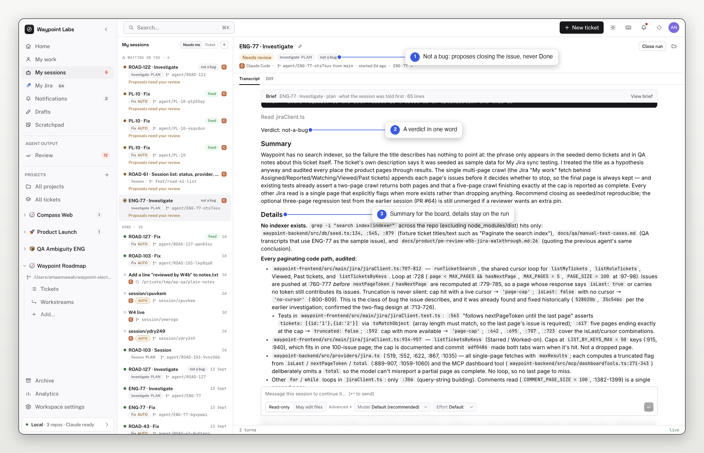
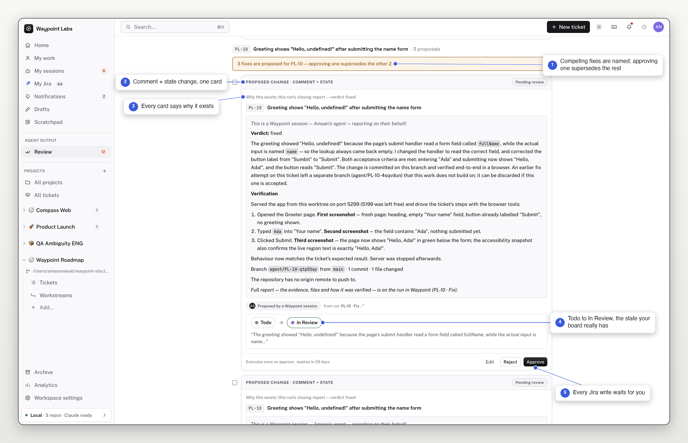
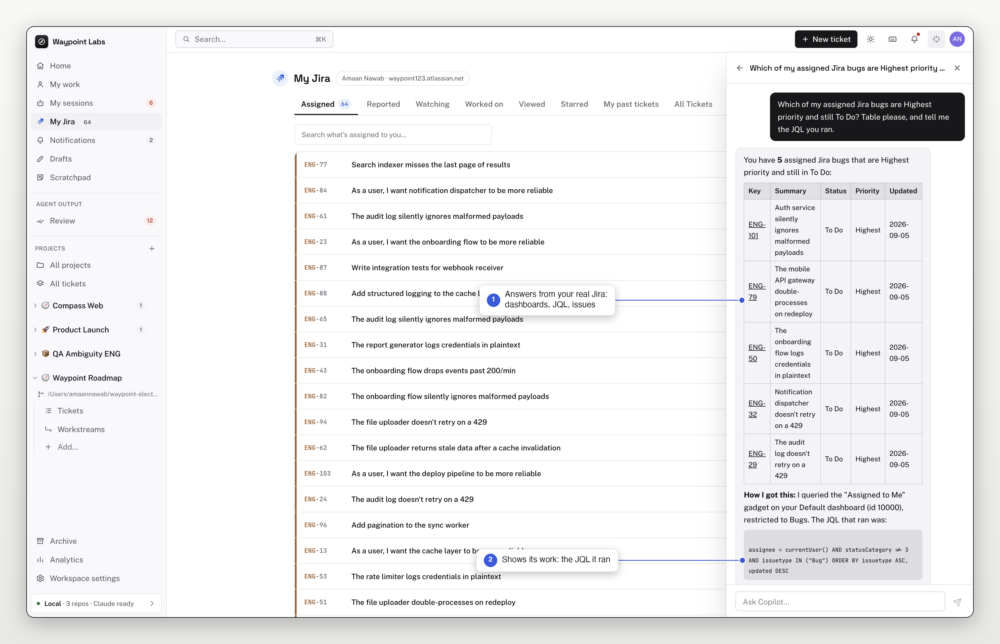
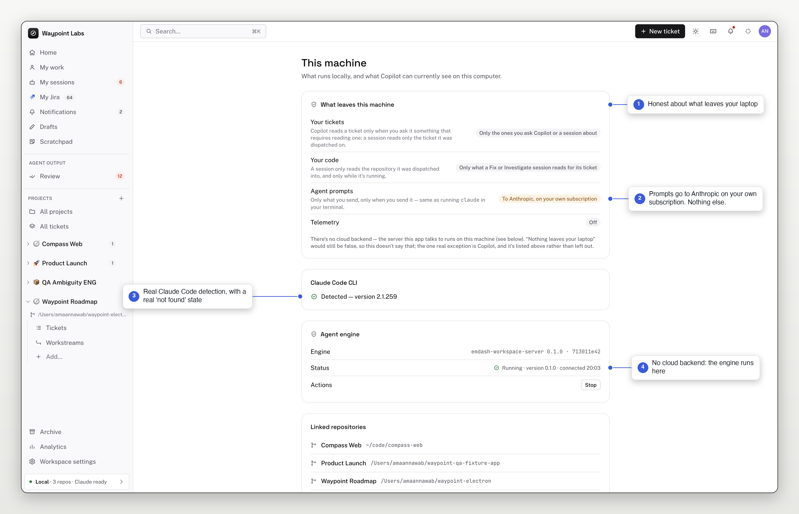
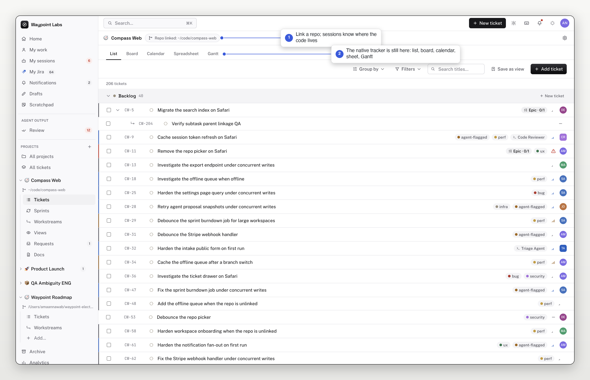

# Waypoint

**A PM companion for teams that already live in Jira.** Connect your Jira
site, and Waypoint puts an AI layer on top of the tickets you already have:
a Copilot that reads your real issues, dashboards and JQL; coding sessions
that investigate or fix a ticket in an isolated git worktree; and a Review
queue where every write back to Jira waits for a person. Native desktop
app, local backend, your own Claude subscription. Nothing posts a comment,
moves a ticket, opens a PR or starts an agent without you pressing the
button.



## How it works

1. **Connect Jira.** My Jira shows what is assigned to you, reported by
   you, watched, worked on, starred. Click an issue, see the core fields
   on top, comment, or hand it to a session.
2. **Ask Copilot, or dispatch a session.** Copilot answers from your real
   Jira data and proposes changes. Investigate, Fix or Something else…
   opens a written brief you read (and edit) before anything runs.
3. **Review and approve.** Every proposal — a comment, a state change —
   lands in Review with the reason it exists. Approve, edit, or reject.
   Only then does Jira hear about it.

## Sessions: a ticket handed to an agent, and back



- **Investigate** finds the root cause and changes nothing. **Fix**
  implements it. **Something else…** takes any instruction, with a switch
  for whether files may change.
- Every session runs in a fresh git worktree on its own `agent/<KEY>`
  branch, from the base branch you pick. Close run removes both.
- A Fix can verify itself in an isolated browser; the screenshots land
  in the transcript, full-size viewer included.
- The composer is never locked. Message a run that is done, failed or
  waiting on review — it resumes, and every send lands somewhere.

## Nothing starts without you



The brief is built from the issue as Jira has it now — summary,
description, status, priority, the newest comments — plus Waypoint's
instructions for the verb. You read it, edit it, choose the folder and
the base branch, and press Start session. Until then, nothing has run.

## Verdicts that map to real Jira states



- Every session ends with a one-word verdict: `fixed`, `partial`,
  `not-a-bug`, `wont-fix`, `needs-info`, `delivered`, `root-cause`.
- The verdict decides what is proposed. Fixed proposes the review state.
  Not a bug proposes *closing* the issue — never Done. Delivered (it
  already shipped) closes as done. Needs info proposes the comment alone.
- The Summary is written for the board's readers; the evidence, files
  and how it was verified stay on the run.

## Review: every Jira write waits for you



- One card per report: the session's comment and the state change it
  justifies travel together, with "why this exists" on top.
- Competing fixes on the same ticket are named; approving one supersedes
  the rest.
- Edit the agent's words before they post. Approving a transition is
  re-checked live against the issue; if someone moved it in Jira
  meanwhile, the card goes stale and nothing is applied.
- Comments post with a disclosure line, as PM-grade Jira comments —
  headings, lists and code, not a wall of file paths.

## Copilot: ask your Jira in plain words



- Reads your dashboards, gadgets, JQL and issues, and shows its work.
- Proposes writes; never makes them. Ticket text is treated as untrusted
  data, and secret-shaped paths are denied to its read tools.
- `/investigate KEY`, `/fix KEY` and plain "look at ENG-4" open the same
  brief preview. It knows a ticket's session history before offering
  another run.
- Optional "use my Chrome" lets it drive your own browser, behind
  tool-level guardrails.

## Honest by design



There is no Waypoint server. The engine runs on your laptop; your
tickets and code are never uploaded to us. The one thing that leaves is
what you send to Anthropic under your own subscription — the same as
running `claude` in a terminal — and the This machine page says exactly
that, with real Claude Code detection and a real "not detected" state.
"Nothing leaves your laptop" would be false, so the app does not say it.

## Also in the box



A native tracker for teams without Jira — projects, tickets, sprints,
workstreams, docs, saved views, requests — with list, board, calendar,
spreadsheet and Gantt layouts. Sessions and Review work on native tickets
exactly as they do on Jira issues.

## Getting started

You need both halves running — the desktop app has no offline/mock mode,
it always talks to a real backend.

**Prerequisites:** [Docker](https://www.docker.com/products/docker-desktop/)
and Node.js 22+ (see `waypoint-frontend/.nvmrc`).

```bash
./scripts/dev.sh
```

That builds and starts the backend (Postgres + the API) in Docker, waits
for it to come up healthy, applies migrations, seeds demo data on a first
run only, then launches the desktop app. Later runs reuse your data.

To stop the backend afterward: `./scripts/stop.sh` (add `--wipe` to also
delete its data).

<details>
<summary>Running each half manually instead</summary>

```bash
# 1. Backend
cd waypoint-backend
cp .env.example .env
docker compose up -d postgres  # just Postgres — `up -d` with no service
                                # name also starts the api container, which
                                # conflicts on :14000 with `npm run dev` below
npm install
npm run db:generate && npm run db:migrate && npm run db:seed  # destructive:
                                # truncates every table first
npm run dev              # http://localhost:14000

# 2. Frontend, in a second terminal
cd waypoint-frontend
npm install
npm start                 # opens the Electron app, hot-reloading
```

</details>

| Folder | What it is |
|---|---|
| [`waypoint-frontend`](./waypoint-frontend) | The Electron + React desktop app, and the main process that hosts sessions |
| [`waypoint-backend`](./waypoint-backend) | The Express + Postgres API: tracker, proposals, Jira proxy, MCP tools |

See each folder's README for the full script list, project layout, proxy
notes and how to build a packaged installer.

## Stack

**Frontend:** Electron, React 19, React Router, TypeScript, Tailwind CSS,
webpack (via `electron-react-boilerplate`'s toolchain). Sessions run on
Claude Code through a fork of emdash's workspace server.

**Backend:** Express, Drizzle ORM, Postgres, Zod, TypeScript.

## License

AGPL-3.0 — see [`LICENSE`](./LICENSE). If you run a modified version of this
project as a network service, section 13 requires you to make the modified
source available to users of that service.
